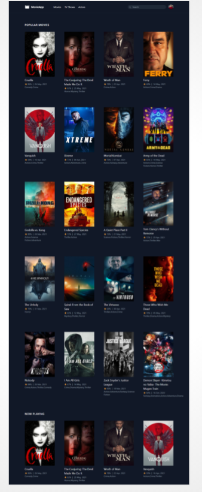
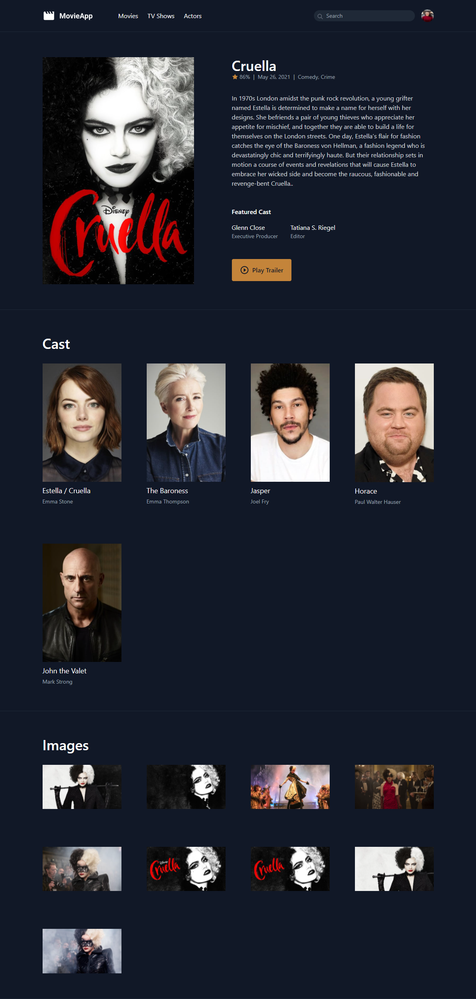
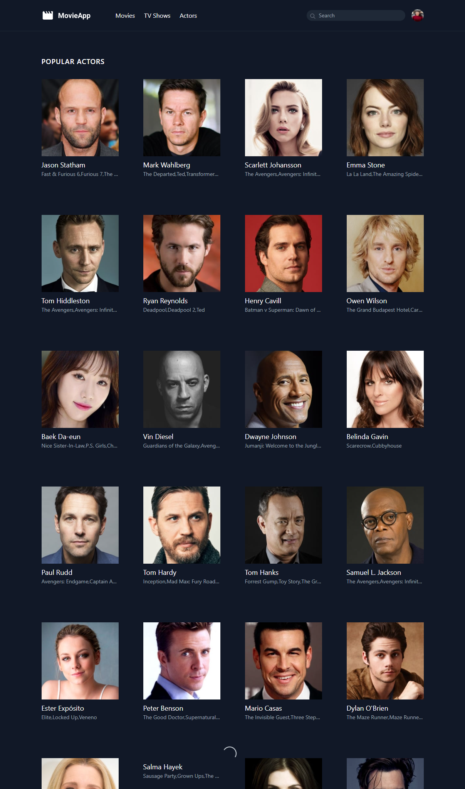
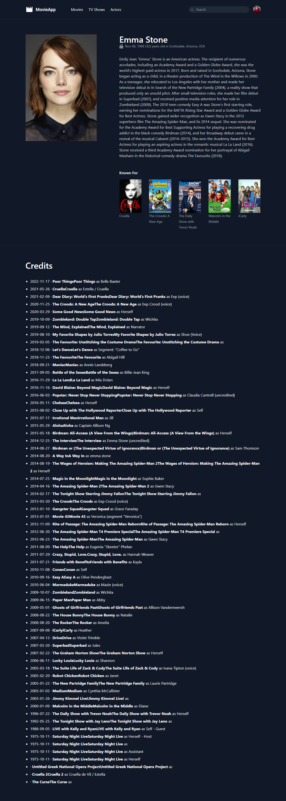
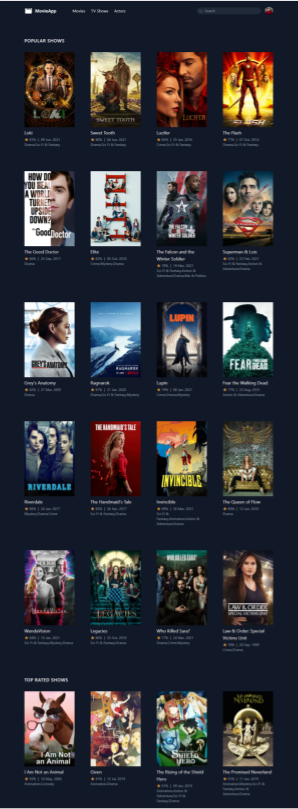

# Laravel Movies API

 O objectivo dessa aplicação e colocar em práticas meus estudos e pesquisas usando  a framewwork Laravel e seus Helpers como o consumo de api que foi principalmente necessário para construção dessa aplicação. Utilizei a API do Theme Movie para construção da aplicação.

## 🚀 Techs

<ul>
<li> Laravel </li>
<li> Livewire </li>
<li> Tailwind CSS </li>

</ul>

### 🖼️ Images

